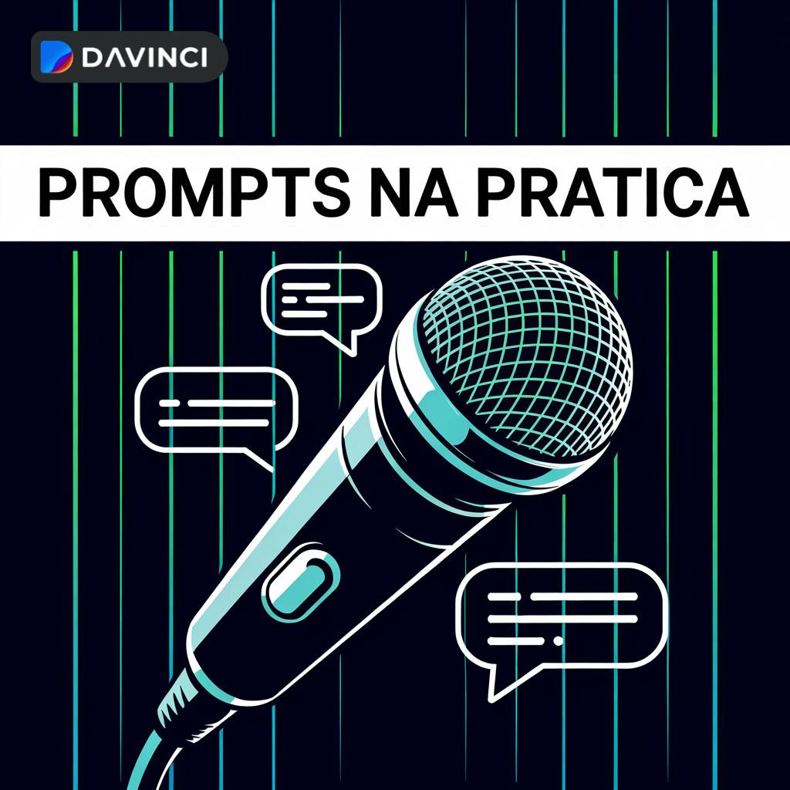

# Prompts na Pratica: podcast com IA

<p align="center">
  
</p>

<p align="center">
  <a href="https://dio.me/">
    
  </a>
  
</p>

## Preview

Ouça o episodio final:

<div align="center">
  <audio src="./output/podcast_editado.mp3" controls title="Podcast Prompts na Pratica"></audio>
</div>

## Sobre o projeto

Este repositorio foi criado para o desafio da DIO de produzir um podcast com apoio de ferramentas de inteligencia artificial.

O tema escolhido foi **engenharia de prompts para iniciantes**. A proposta e mostrar, em poucos minutos, como uma instrucao bem escrita muda a qualidade da resposta de um modelo de IA.

O episodio explica o que e um prompt, compara um pedido vago com um pedido melhor estruturado e fecha com dicas praticas para conversar melhor com modelos de IA.

## Fluxo do desafio

O projeto segue o fluxo proposto nas aulas:

1. **ChatGPT** para criar um titulo atrativo e um roteiro magnetico.
2. **IA de imagem** para gerar uma capa personalizada a partir do prompt de capa.
3. **ElevenLabs** para gerar uma voz mais humanizada.
4. **GitHub** para organizar prompts, roteiro, capa e audio final.

## Aulas usadas como base

O projeto foi organizado seguindo os pontos trabalhados durante as aulas:

- por que criar um podcast;
- definicao de um grupo ou publico-alvo;
- o que e prompt engineering;
- como escrever prompts melhores;
- conceitos avancados de prompt;
- criacao de um titulo mais forte;
- imagem de capa e dicas de Midjourney;
- roteiro com variaveis;
- geracao de audio com ElevenLabs;
- edicao simples do podcast;
- entrega do projeto no GitHub;
- transcricao e documentacao do processo.

## Arquivos principais

```text
desafio-podcast-ia/
|-- README.md
|-- assets/
|   |-- cover.jpeg
|   `-- cover.svg
|-- audio/
|   |-- podcast-prompts-na-pratica.mp3
|   `-- podcast-prompts-na-pratica.wav
|-- output/
|   |-- podcast_editado.mp3
|   `-- podcast-prompts-na-pratica.wav
|-- roteiro-podcast.md
|-- prompts.md
|-- scripts/
|   `-- gerar-audio.ps1
`-- src/
    `-- prompts/
        |-- audio.md
        |-- capa.md
        |-- chatgpt.md
        |-- edicao.md
        |-- elevenlabs.md
        `-- midjourney.md
```

## Como foi feito

1. Defini o publico do podcast: pessoas iniciantes em IA.
2. Usei prompts no estilo ChatGPT para escolher tema, titulo e estrutura.
3. Escrevi um roteiro curto, com linguagem simples e tom de conversa.
4. Revisei o texto para reduzir cara de texto gerado automaticamente.
5. Usei um prompt visual para criar a capa personalizada.
6. Gerei o audio final no ElevenLabs.
7. Salvei o audio final em `output/podcast_editado.mp3`.
8. Organizei o repositorio seguindo a base indicada no desafio.

## Ferramentas usadas

- ChatGPT para ideacao, titulo, estrutura e roteiro.
- IA de imagem para capa personalizada.
- ElevenLabs para voz mais humanizada.
- GitHub para versionamento e entrega do projeto.
- Markdown para documentacao.

## Prompts

Os prompts usados estao documentados em:

- [`prompts.md`](./prompts.md)
- [`src/prompts/chatgpt.md`](./src/prompts/chatgpt.md)
- [`src/prompts/midjourney.md`](./src/prompts/midjourney.md)
- [`src/prompts/elevenlabs.md`](./src/prompts/elevenlabs.md)
- [`src/prompts/audio.md`](./src/prompts/audio.md)
- [`src/prompts/capa.md`](./src/prompts/capa.md)
- [`src/prompts/edicao.md`](./src/prompts/edicao.md)

## Audio final

O arquivo final do podcast esta em:

```text
output/podcast_editado.mp3
```

Tambem deixei uma copia em:

```text
audio/podcast-prompts-na-pratica.mp3
```

## Alternativa local

O repositorio tambem mantem uma versao WAV gerada localmente para teste.

Para recriar essa versao no Windows:

```powershell
powershell.exe -ExecutionPolicy Bypass -File .\scripts\gerar-audio.ps1
```

## Referencia

Este projeto foi inspirado na estrutura do repositorio base indicado pela DIO:

https://github.com/felipeAguiarCode/prompts-for-podcast-generate-by-ia

