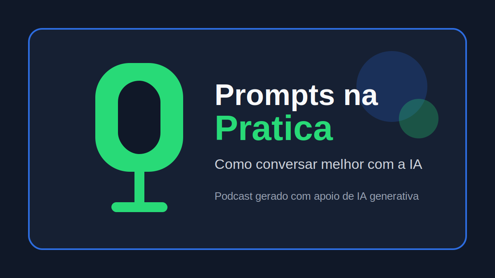

# Prompts na Pratica: podcast com IA

<p align="center">
  
</p>

<p align="center">
  <a href="https://dio.me/">
    
  </a>
  
</p>

## Preview

Ouça o episodio final:

<div align="center">
  <audio src="./output/podcast-prompts-na-pratica.wav" controls title="Podcast Prompts na Pratica"></audio>
</div>

## Sobre o projeto

Este repositorio foi criado para o desafio da DIO de produzir um podcast com apoio de ferramentas de inteligencia artificial.

O tema escolhido foi **engenharia de prompts para iniciantes**. A proposta e mostrar, em poucos minutos, como uma instrucao bem escrita muda a qualidade da resposta de um modelo de IA.

O episodio ficou com uma pegada mais didatica: primeiro explica o que e um prompt, depois compara um pedido vago com um pedido melhor estruturado e fecha com dicas praticas.

## Aulas usadas como base

O projeto foi organizado seguindo os pontos trabalhados durante as aulas:

- por que criar um podcast;
- definicao de um grupo ou publico-alvo;
- o que e prompt engineering;
- como escrever prompts melhores;
- conceitos avancados de prompt;
- criacao de um titulo mais forte;
- imagem de capa e dicas de Midjourney;
- roteiro com variaveis;
- geracao de audio com ferramenta de voz;
- edicao simples do podcast;
- entrega do projeto no GitHub;
- transcricao e documentacao do processo.

No meu caso, adaptei a proposta para um podcast curto sobre prompts, com foco em estudantes iniciantes em IA.

## Arquivos principais

```text
desafio-podcast-ia/
|-- README.md
|-- assets/
|   `-- cover.svg
|-- audio/
|   `-- podcast-prompts-na-pratica.wav
|-- output/
|   `-- podcast-prompts-na-pratica.wav
|-- roteiro-podcast.md
|-- prompts.md
|-- scripts/
|   `-- gerar-audio.ps1
`-- src/
    `-- prompts/
        |-- audio.md
        |-- capa.md
        |-- chatgpt.md
        `-- edicao.md
```

## Como foi feito

1. Defini o publico do podcast: pessoas iniciantes em IA.
2. Usei prompts para escolher tema, titulo e estrutura.
3. Escrevi um roteiro curto, com linguagem simples e tom de conversa.
4. Revisei o texto para reduzir cara de texto gerado automaticamente.
5. Criei uma capa simples para representar o projeto.
6. Gerei a narracao com sintese de voz no Windows.
7. Ajustei pausas no script para deixar o audio menos mecanico.
8. Organizei o repositorio seguindo a base indicada no desafio.

## Ferramentas e conceitos

- ChatGPT para ideacao, estrutura e revisao do roteiro
- PowerShell com `System.Speech` para gerar o audio
- Engenharia de prompt
- Roteirizacao para podcast
- Git e GitHub
- Markdown

## Prompts

Os prompts usados estao documentados em:

- [`prompts.md`](./prompts.md)
- [`src/prompts/chatgpt.md`](./src/prompts/chatgpt.md)
- [`src/prompts/audio.md`](./src/prompts/audio.md)
- [`src/prompts/capa.md`](./src/prompts/capa.md)
- [`src/prompts/edicao.md`](./src/prompts/edicao.md)

## Como gerar o audio novamente

No Windows, rode:

```powershell
powershell.exe -ExecutionPolicy Bypass -File .\scripts\gerar-audio.ps1
```

O audio sera gerado em:

```text
audio/podcast-prompts-na-pratica.wav
```

Depois, copie ou substitua tambem o arquivo em `output/`, que e o caminho usado no preview do README.

## Referencia

Este projeto foi inspirado na estrutura do repositorio base indicado pela DIO:

https://github.com/felipeAguiarCode/prompts-for-podcast-generate-by-ia
